#+begin meta
id: 20260508T000000-20260508
title: Some QC related projects
date: 2026-05-08
tags: note
source: roam/daily/uni/qc/ReadingGroup/20260508.md
#+end meta
# Some QC related projects
# Ron Steinfeld

## Privacy-Oriented Cryptographic Protocols (Problem)

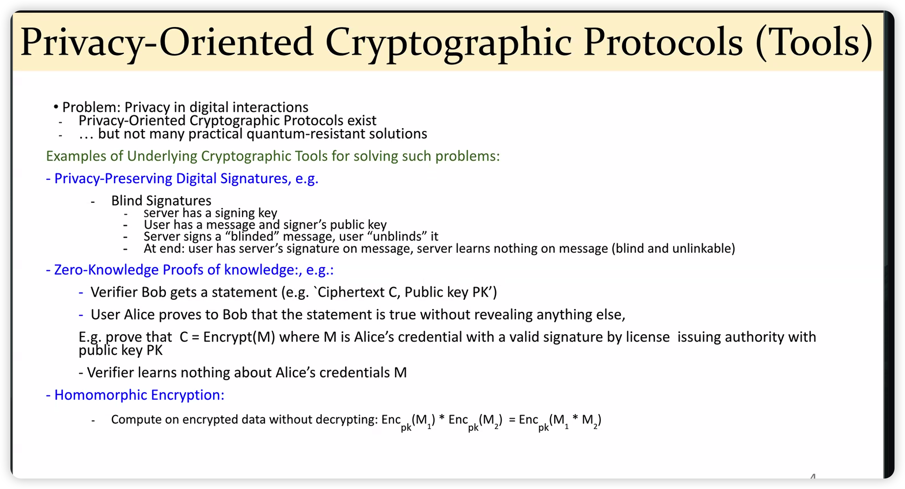
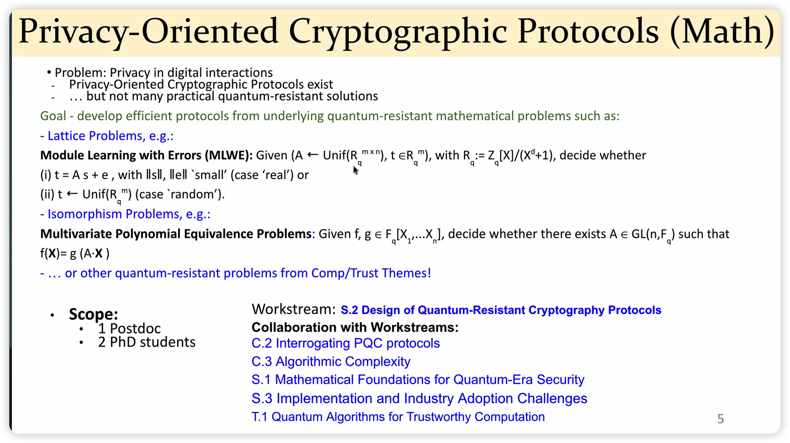

## Quantum-Powered Public-Key Cryptography (Problem)

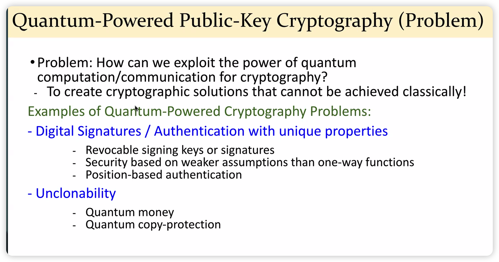
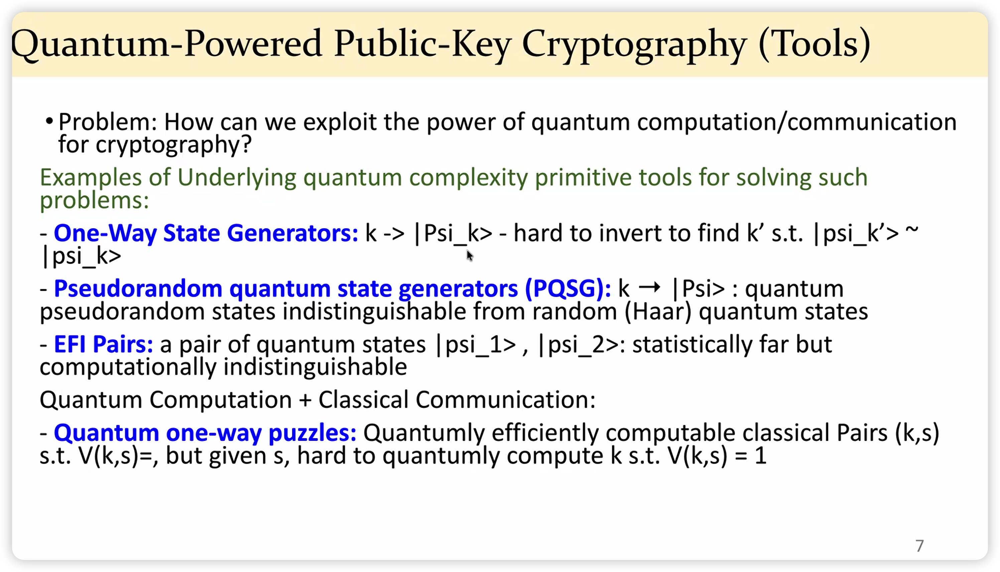

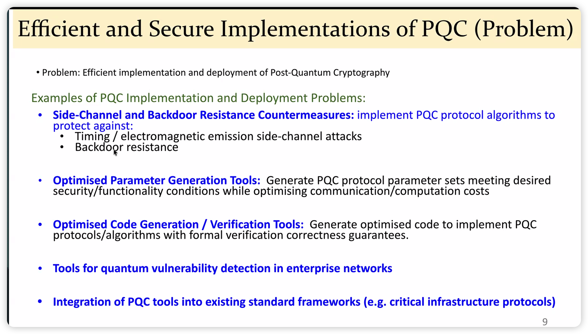

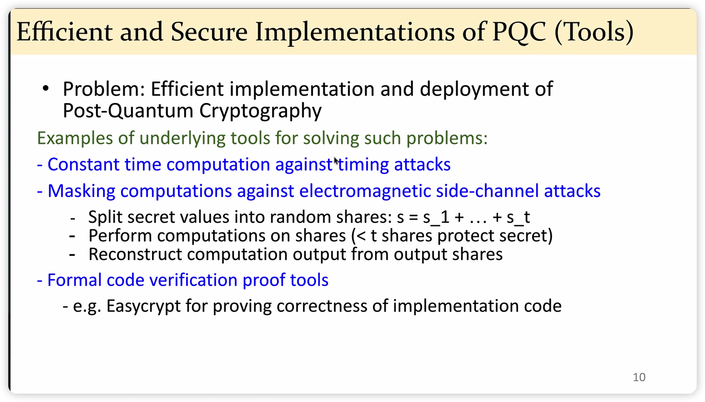
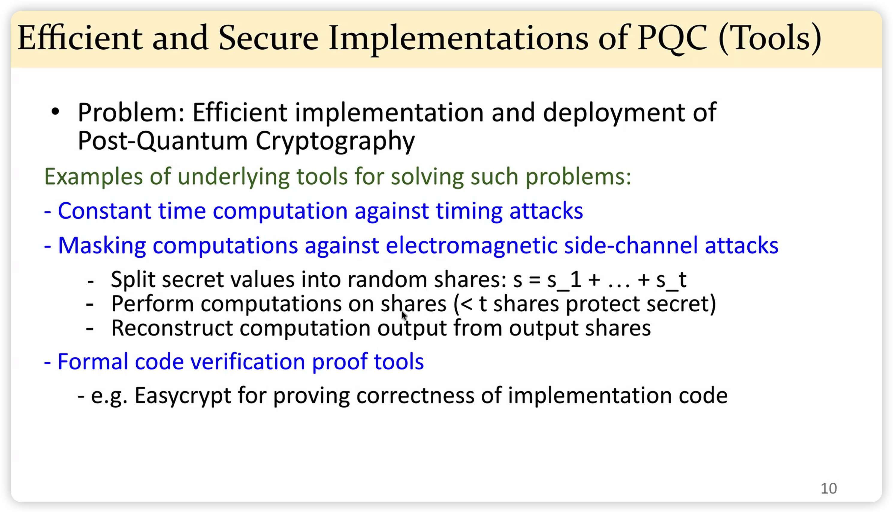
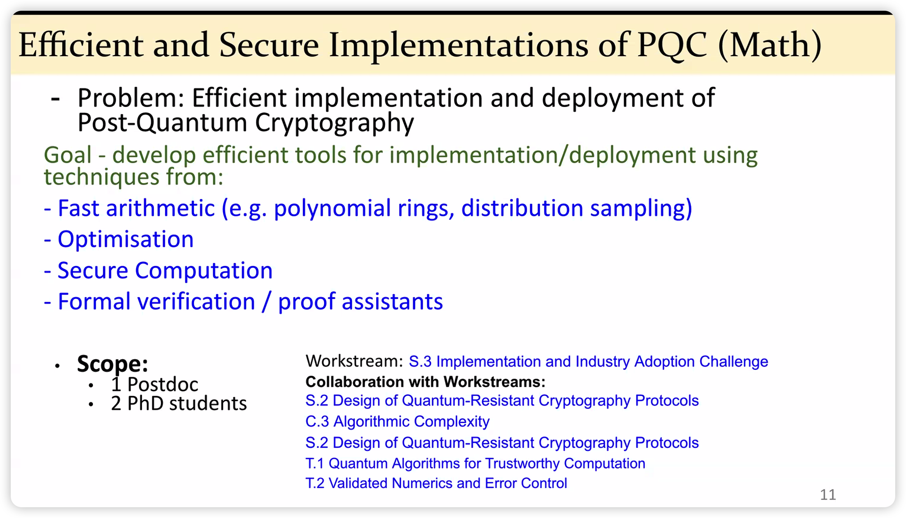

# Khoa Nguyen
## New Post-Quantum Hardness Landscapes from Combinatoria Structures

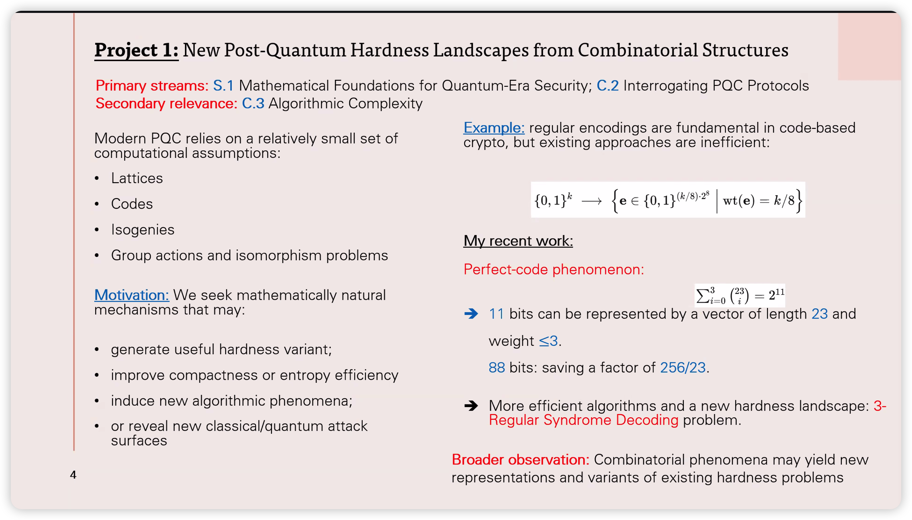

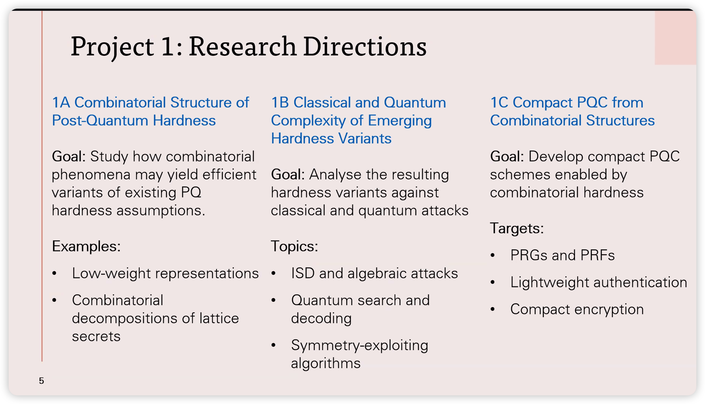

## Privacy-Preserving Cryptography with Controlled Information Exposure

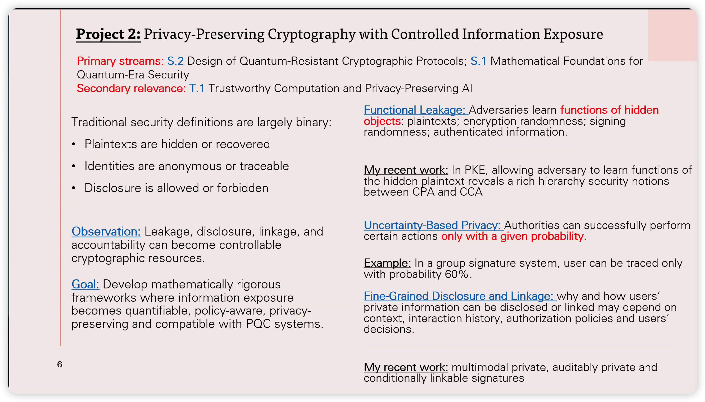

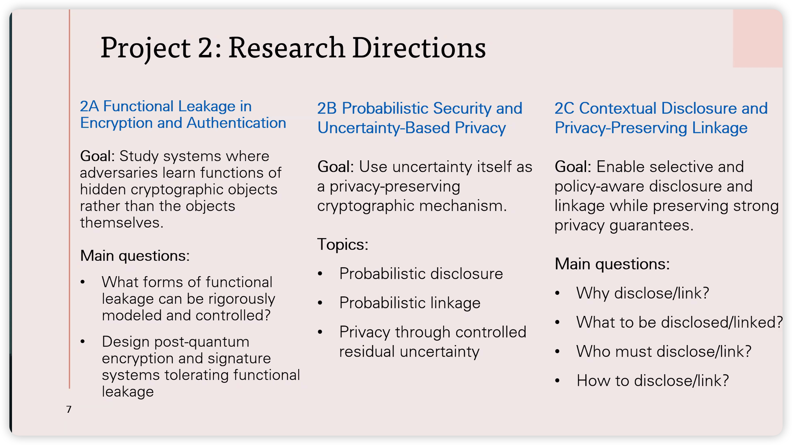

## Privacy-Preserving Interaction with AI Systems

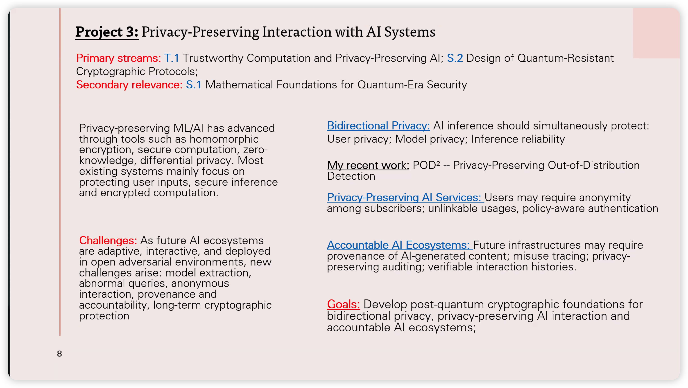

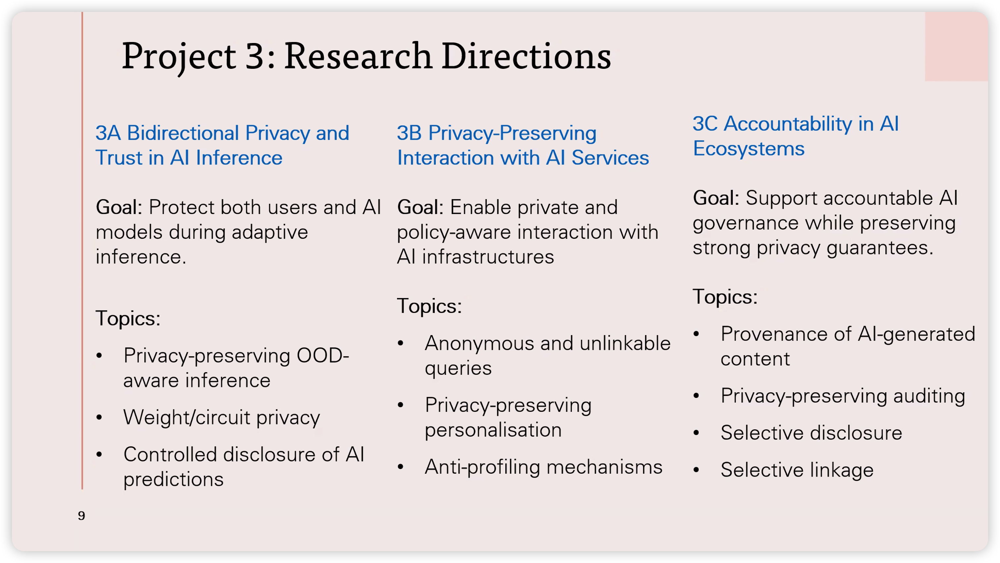
# Clement Canonne
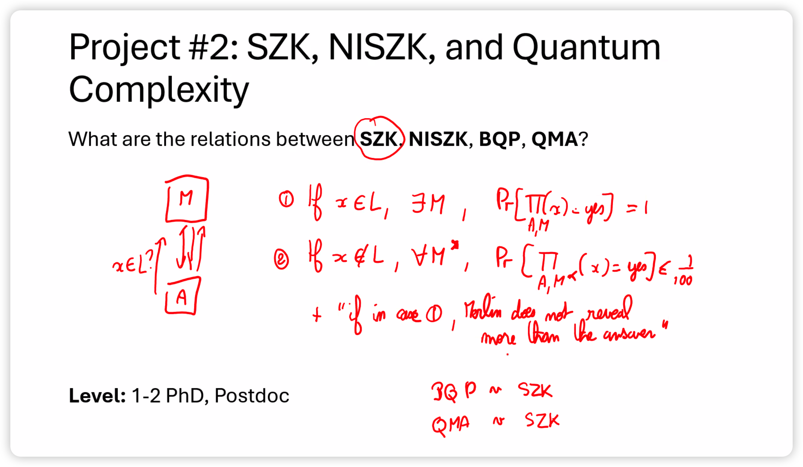

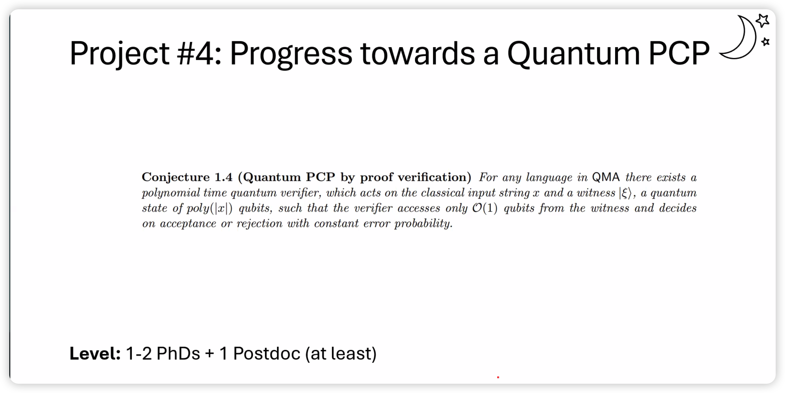
